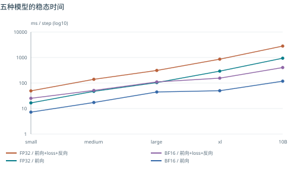
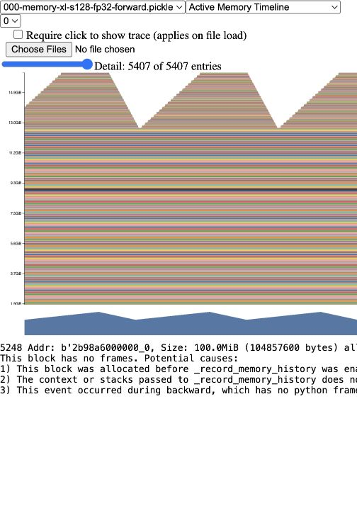
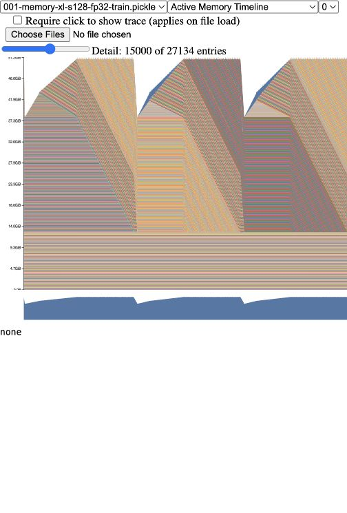
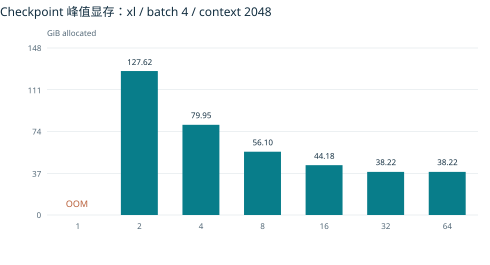
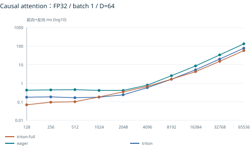
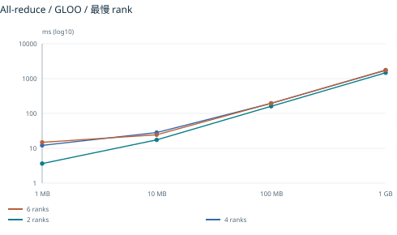
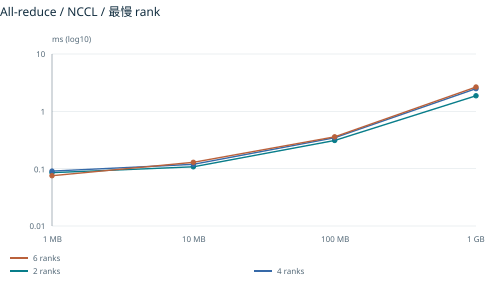
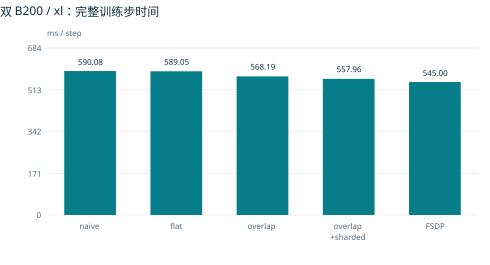

# CS336 Assignment 2：已有实验与复现报告

## 阅读说明与完成边界

本报告整理截至 2026-09-14 已取得的真实实验记录。文档、汇总和图表在本地生成，不启动 Modal GPU 或 CPU 容器。它是“已有证据完成版”，不是“全部实验通过”或“可无缺项提交”的声明。待补项目见最后的 GPU 任务清单。

数据集中共有 448 条去重的实验结果记录，其中 431 条状态为 ok。实验记录数不等于单元测试数；历史失败和 OOM 单独保留。最新实验开始时间（UTC）：2026-09-14T09:40:55.765216+00:00。Flash 最后两格、10B compiled 及 tuned 候选的结果与所需环境/源码归档已只读补齐；证据包不是全部远程文件及编译缓存的备份。

最重要的实际缺项是：编译模型的完整训练步对照、小/中模型独立阶段计时、其余模型与通信时间线、单 block 显存释放诊断，以及最终修订版的 GPU 回归验证。MemoryViz 两张主图已完成，Flash 的 240 组计时已齐，无须重新运行。缺项不通过理论数值或合成截图填补。

## 实验平台与统一口径

- GPU：Modal NVIDIA B200；单卡或同一任务内 2/4/6 卡；不是 B300。精确设备信息和环境由每次运行的 environment.json、nvidia-smi.txt 记录。
- 软件：PyTorch 2.11.0 + CUDA 12.8、Triton 3.6.0；Nsight CLI 2026.5.1。不同运行以自身 pip-freeze 和源文件 SHA256 为准。
- 基线：本作业随附的 staff cs336-basics Transformer 与 AdamW，不改动用户 Assignment 1 的实现或训练结果。
- 常规默认：vocab=10000、batch=4、context=512、随机输入、seed=2026。FP32 全模型关闭 TF32；BF16 autocast 保留 FP32 主参数及状态。
- forward 指前向；backward 模式指前向+交叉熵+反向；train 指前向+交叉熵+反向+AdamW。CUDA-event 分阶段计时另列，不能把组合时间写成反向单独耗时。
- 常规模型测试每配置 10 个测量样本；5 次预热为主对照，0/1/2 次用于冷启动敏感性。Flash 使用 triton.testing.do_bench，warmup=100 ms、rep=300 ms，不虚构未保存的标准差。
- 多卡表采用逐步最慢 rank 再求均值；all-reduce 的 MB 为十进制。所有具体 case 参数、命令、超时及种子以附录和原始记录为准。

## 1. 五模型基准与混合精度

基础矩阵的配置均已尝试，10B 的完整 AdamW 训练存在真实 OOM；OOM 不等于脚本未运行。10B 名称只是 handout 的型号标签，实际参数量以记录为准。五种模型的 compiled 前向与前向+反向也已测量，其中 10B 使用已保存返回值补充证据。

图 1：稳态 wall-clock 均值，对数纵轴。前向+反向曲线包含 loss，不包含优化器。所有 10 个样本及均值、标准差见数据表。

BF16 对大模型的加速更明显，但不能据此断言训练显存减半：参数、梯度和 Adam 状态仍可能为 FP32；autocast 的权重转换缓存也会增加短上下文前向的活跃内存。小/中模型早期记录没有直接的 CUDA-event 阶段计时，报告保留组合测量而不以两个独立实验的均值相减伪装成直接测量。

## 2. 显存与 checkpoint

xl 已运行 context=128/2048、FP32/BF16、forward/train 的 8 个配置。能完成的配置记录 allocated/reserved 及峰值；OOM 配置记录异常与失败时内存，不把失败点内存当成可成功完成训练的峰值。五份已有 pickle 已经通过只读存储接口取回，两张 Active Memory Timeline 使用官方 PyTorch v2.11.0 MemoryViz 在本地浏览器打开并直接截图，没有重新运行 GPU。

显存图 A：xl / context 128 / FP32 / forward。原始快照含两个测量步和随后一个记录阶段信息的额外步，因此图上出现重复的上升、释放形态；横轴是分配事件序列，不能当作毫秒时间轴。

显存图 B：相同配置的完整训练步。图中保留了 MemoryViz 的选择项和 Detail 数量，未裁剪或改绘。精确峰值由 CUDA 内存统计给出：前向 18.05 GiB、训练 51.41 GiB。仅凭形态不能严格确定每一个阶段边界，需要结合阶段数值与分配栈。具体大分配归因见 handout 答案。

图 2：横轴为 checkpoint 分段数。32 段是每层一个 checkpoint，16 段是两层一个，64 段按 attention/FFN 半层切分；1 段运行 OOM。1 MiB 级差别不足以证明半层和整层存在稳定的显存优劣。

单层 TransformerBlock 已用 saved_tensors_hooks 对保存的独立 storage 去重统计，并排除参数/缓冲区别名；该统计可支持显存归因推理，但并非 handout 要求的 Nsight 分配事件截图。算子名称是保存张量的 producer/module 标签，也不能当作 CUDA kernel 名。

## 3. Attention 与 FlashAttention

普通 PyTorch / compiled attention 的 batch=8 规定矩阵共 40 个配置已有结果，规定范围内没有 OOM；没有为满足叙述而虚构“最小 OOM”。Flash 的三实现扩展矩阵共 240 个配置，均已有前向、反向、端到端三项计时。此前缺归档的两个必做 Triton 配置已通过已结束调用的返回值及只读存储文件补齐，没有再开 GPU。

图 3：FP32、D=64 的端到端前向+反向切片。完整 FP32/BF16、D=16/32/64/128、S=128..65536 表在附录。全 Triton backward 属于额外实现；必做版本是 Triton forward + PyTorch compiled backward。Triton 的 tf32x3 执行与全模型 baseline 关闭 TF32 的设置不同，必须结合数值验证解释速度。

## 4. 通信、DDP 与 FSDP

同节点 2/4/6 ranks、Gloo/NCCL、1/10/100/1000 MB 的 24 个通信配置已测量。Gloo 使用 CPU 张量，但当时的历史作业仍分配了 GPU，不能将历史成本标成零；此次整理不重跑这些任务。

图 4-5：每轮最慢 rank 的 all-reduce 时间。CPU 配额固定，跨作业节点并非保证同一物理机器；这些差异限制了带宽扩展结论。bus bandwidth 是按通信算法流量推导的指标，不是直接读出的 NVLink 线速。

图 6：两卡 xl 模型的训练步时间，含实际同步及优化器更新。所有原始 rank 样本和初始化/优化器前后显存见附录。overlap 的 exposed_sync 只是反向结束后未隐藏的等待，不能代表总通信时间，更不能代替时间线证明通信重叠。

## 5. 完整 8B 候选的真实结果

两张 B200、34 层、d_model=4096、d_ff=11008、32 heads、vocab=151936、context=32768、全局 batch=2。使用自编 Triton attention、block checkpoint、分块投影交叉熵、重叠 DDP、优化器状态分片及自编 fused AdamW。

初次完整候选稳态均值为 9.7024 s/step（3 次），调整 tile 后为 6.7601 s/step（5 次），本次样本均值降低约 30.3%。两组都保留冷启动与预热记录。计时来自本项目同步后的全步 wall-clock，不是已通过课程官方排行榜验证的成绩；不同计时协议不能直接等同。

小规模数值检查和核心测试已有通过记录，但不宣称完整 8B 输出/梯度逐项与官方参考模型比较过；最终候选在课程误差容限、适配器及最终源版本上的验证仍属于交付前检查。由于预算暂停，不再为进一步调优申请 GPU。

## 6. Profiling 故障与证据边界

早期 Nsight 导出包含 CUDA API、NVTX 和内存事件，但缺少 CUPTI_ACTIVITY_KIND_KERNEL；分析日志明确报 no such table。运行返回 ok 或 trace_created=true 只说明目标程序及导出结束，不足以说明捕获有效 GPU kernel。

最后一次 cuda-sw 软件追踪探针的完整 SQLite 和 nsys-rep 已通过只读存储接口取回，包含 3637 个真实 GPU kernel，总执行时间 29.847779 ms。修复本地解析器对 autograd 工作线程的归因后，measurement 全部 kernel 均有匹配，backward 正确累计为 16.380591 ms，而不是旧解析结果的 0.001312 ms。此修复只重算已有数据，没有使用 GPU。

该 small/context256 配置可复用为六项中的一项；其余五个模型 profile、两份 DDP 重叠 trace、一份 FSDP trace 仍缺有效 GPU 证据。现有探针的完整问题回答、归因规则和诊断限制见补充 Nsight 分析附录。统计汇总不是 GUI 截图，不冒充已完成所有 profiling 交付。

## 7. 本地复现与交付文件

本地重建命令见 output/README.md；三个报告/汇总/打包脚本均不调用 Modal 或 CUDA。原始文件只读，结果保留来源；成本只计有依据的运行期估价，不是账单。下列附录给出逐题解答、全量数值、过程和待补任务。
